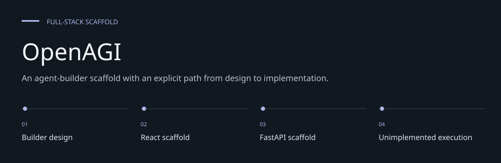
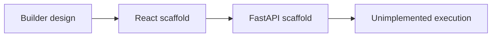

# OpenAGI

**An agent-builder scaffold with an explicit path from design to implementation.**

A React and FastAPI scaffold for assembling AI components into workflows.
The repository captures a proposed builder interface and partial backend models.
It does not yet provide a working end-to-end agent execution platform.


[Architecture](docs/ARCHITECTURE.md) · [Evaluation guide](docs/EVALUATION.md)

**Contents:** [The challenge](#the-challenge) · [Walkthrough](#walk-through-the-project) ·
[Implementation](#implementation-state) · [Design choices](#engineering-choices) ·
[Next evidence](#next-evidence-to-collect)

---

## The challenge

A low-code agent builder has to align the canvas, component catalog, persistence and execution
API. This repository records the start of that design, but its frontend/backend contracts and
entry-point wiring are incomplete. Understanding those boundaries is the useful first step toward
a working system.

## System at a glance



## Walk through the project

### 1. Read the intended design

Compare DESIGN.md with the actual frontend and backend files. Treat requirements as proposed scope
rather than completed functionality.

### 2. Inspect the editor source

Review the sidebar and MainContent component, their props and expected API calls. The current
app/entry wiring does not form a verified runnable frontend.

### 3. Inspect the API model

Follow LLM/Agent models and component/workflow routes. Compare schema placement, response models
and database configuration with the UI expectations.

### 4. Reconcile before running

Resolve entry points, imports, dependencies and contracts before an end-to-end trial. No API
provider execution pipeline is supplied by the current scaffold.

## Implementation map

| Area | What exists | Current limit |
| --- | --- | --- |
| Frontend | Sidebar and workflow editor | Entry/import wiring incomplete |
| API | Workflow route and component create/list handlers | Frontend endpoint contract differs |
| Data | SQLAlchemy LLM and Agent models | Database setup is inconsistent |
| AI execution | Design description | No provider execution pipeline |

[DESIGN.md](DESIGN.md) describes the intended architecture, rather than completed capabilities.
Source lives under [openagi](openagi).

## Inspect the scaffold

The frontend package is in `openagi/frontend`; Python dependencies are in
`openagi/backend/requirements.txt`. The frontend declares React 17 and react-scripts 4.
Backend packages are unpinned.

```bash
git clone https://github.com/DanushArun/OpenAGI_project_final.git
cd OpenAGI_project_final
python3 -m venv .venv
source .venv/bin/activate
python -m pip install -r openagi/backend/requirements.txt
cd openagi/frontend
npm install
```

These commands install dependencies. A successful application launch needs the wiring issues
below resolved first; installation alone is not evidence that the scaffold works.

## Known launch blockers

- The frontend entry is a directory named `src/index.js` containing HTML, not a React entry file.
- `src/app.js` imports `./MainContent`, but that component is under `src/components`.
- The start script uses `cross-env`, which is not declared as a dependency.
- The backend schema file is nested under a directory named `schemas.py`.
- Component handlers use `List` without importing it and use an ORM model as a response schema.
- Backend startup references PostgreSQL while the SQLAlchemy setup points at SQLite.
- The frontend requests agents/tools/LLMs routes that the backend does not expose as written.

The database URL in source is an example configuration. Configure a real database through an
appropriate local configuration before attempting to run it.

## Evidence and boundaries

The README was checked against tracked source and dependency manifests. No end-to-end launch
or provider call was performed. There is no automated test suite or verified deployment here.
Workflow execution, complete component CRUD and production readiness remain unverified.

## Engineering choices

**Design and build remain separate.** A design document does not prove that its routes and models
were implemented.

**Contracts before integration.** The frontend requested resources and backend routes must agree
before an execution claim.

**Syntax is a narrow check.** Parsing Python does not catch missing runtime names or incorrect
ORM/Pydantic usage.

## Implementation state

| State | Current evidence |
| --- | --- |
| Present | Builder design and partial interface components |
| Present | Partial API routes and LLM/Agent models |
| Blocked | Entry/import/schema/database contract wiring |
| Not implemented | Verified end-to-end agent execution |

The [architecture guide](docs/ARCHITECTURE.md) maps these statements to source entry points.
The [evaluation guide](docs/EVALUATION.md) separates inspection, executable checks and
domain validation, with the next evidence needed for each project.

## Next evidence to collect

- Reconcile frontend entry points and imports.
- Define a single database/schema contract.
- Build and test one complete saved workflow before expanding execution scope.
