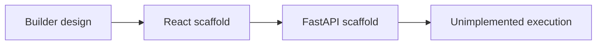

# OpenAGI — Architecture and implementation

This guide follows the tracked implementation. Proposed work is identified separately.

## The problem and the system boundary

A low-code agent builder has to align the canvas, component catalog, persistence and execution
API. This repository records the start of that design, but its frontend/backend contracts and
entry-point wiring are incomplete. Understanding those boundaries is the useful first step toward
a working system.

## Processing path

## End-to-end behavior

### 1. Read the intended design

Compare DESIGN.md with the actual frontend and backend files. Treat requirements as proposed scope
rather than completed functionality.

### 2. Inspect the editor source

Review the sidebar and MainContent component, their props and expected API calls. The current
app/entry wiring does not form a verified runnable frontend.

### 3. Inspect the API model

Follow LLM/Agent models and component/workflow routes. Compare schema placement, response models
and database configuration with the UI expectations.

### 4. Reconcile before running

Resolve entry points, imports, dependencies and contracts before an end-to-end trial. No API
provider execution pipeline is supplied by the current scaffold.

## Design choices and consequences

### Design and build remain separate

A design document does not prove that its routes and models were implemented.

### Contracts before integration

The frontend requested resources and backend routes must agree before an execution claim.

### Syntax is a narrow check

Parsing Python does not catch missing runtime names or incorrect ORM/Pydantic usage.

## Source entry points

### [DESIGN.md](../DESIGN.md)

This file is part of the reviewed path described above. Follow its imports and calls
for the exact interface rather than inferring behavior from the filename.

### [openagi/frontend/src/app.js](../openagi/frontend/src/app.js)

This file is part of the reviewed path described above. Follow its imports and calls
for the exact interface rather than inferring behavior from the filename.

###
[openagi/frontend/src/components/MainContent.js](../openagi/frontend/src/components/MainContent.js)

This file is part of the reviewed path described above. Follow its imports and calls
for the exact interface rather than inferring behavior from the filename.

### [openagi/backend/main.py](../openagi/backend/main.py)

- `startup` — Implementation entry; inspect source for its exact behavior.
- `shutdown` — Implementation entry; inspect source for its exact behavior.
- `read_root` — Implementation entry; inspect source for its exact behavior.

## Implementation state

| State | Evidence boundary |
| --- | --- |
| Present | Builder design and partial interface components |
| Present | Partial API routes and LLM/Agent models |
| Blocked | Entry/import/schema/database contract wiring |
| Not implemented | Verified end-to-end agent execution |

“Present” means tracked source or assets exist. It does not mean a production or domain
validation has passed. See [Evaluation](EVALUATION.md) for reproducible checks and limits.
